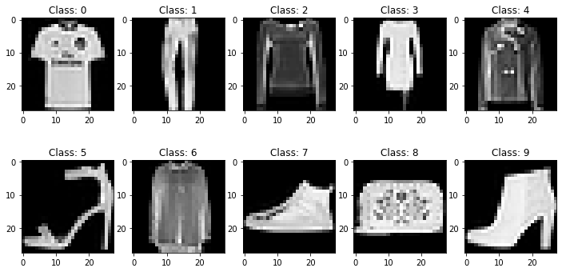
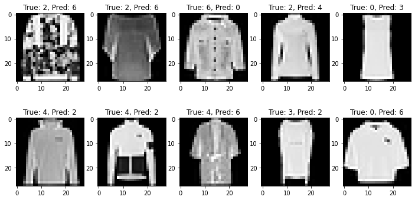

# Fashion-MNIST Classification Project

This project aims to develop a neural network model to classify images from the Zalando Fashion-MNIST dataset.
Dataset Overview

The Fashion-MNIST dataset consists of 70,000 grayscale images of clothing items, divided into 10 categories:

    T-shirt/top
    Trouser
    Pullover
    Dress
    Coat
    Sandal
    Shirt
    Sneaker
    Bag
    Ankle boot

Each image is 28x28 pixels, resulting in 784 features per sample.
Project Objectives

    Train a neural network to achieve high accuracy on the test set.
    Explore different approaches:
        Using raw pixel data as input
        Applying Principal Component Analysis (PCA) for dimensionality reduction
    Visualize and analyze misclassified images
    Compare results with benchmarks from the official Fashion-MNIST repository

Implementation Steps

    Data Preprocessing:
        Load and normalize the data
        Split into training and test sets (if not already provided)
        (Optional) Apply PCA for dimensionality reduction
    Model Development:
        Design and implement neural network architecture
        Train the model on the training set
        Evaluate performance on the test set
    Analysis:
        Visualize misclassified images
        Analyze reasons for misclassification
        Compare performance with benchmarks

## Example images from the Fashion-MNIST dataset



## Results

The model achieved an overall accuracy of 92% on the test set, which is a strong performance for this dataset. Here's a detailed breakdown of the results:

### Confusion Matrix

```
[[855   1  14  17   1   0 104   1   7   0]
 [  1 992   0   6   0   0   1   0   0   0]
 [ 15   0 861   6  47   0  68   0   3   0]
 [  7   5   4 949  16   0  19   0   0   0]
 [  0   2  38  24 867   0  66   0   3   0]
 [  0   0   0   0   0 977   0  20   0   3]
 [102   0  53  28  54   0 757   0   6   0]
 [  0   0   0   0   0  10   0 964   0  26]
 [  0   0   1   0   2   1   1   2 993   0]
 [  0   0   0   0   0   2   0  30   0 968]]
```

### Classification Report

```
              precision    recall  f1-score   support

           0      0.87      0.85      0.86      1000
           1      0.99      0.99      0.99      1000
           2      0.89      0.86      0.87      1000
           3      0.92      0.95      0.93      1000
           4      0.88      0.87      0.87      1000
           5      0.99      0.98      0.98      1000
           6      0.75      0.76      0.75      1000
           7      0.95      0.96      0.96      1000
           8      0.98      0.99      0.99      1000
           9      0.97      0.97      0.97      1000

    accuracy                           0.92     10000
   macro avg      0.92      0.92      0.92     10000
weighted avg      0.92      0.92      0.92     10000
```
### Example Misclassified Images




### Analysis

1. Overall Performance:
   - The model achieved a high accuracy of 92% across all classes.
   - Both macro and weighted averages for precision, recall, and F1-score are 0.92, indicating consistent performance across classes.

2. Per-Class Performance:
   - Best performing classes:
     - Class 1 (Trouser): 0.99 F1-score
     - Class 8 (Bag): 0.99 F1-score
     - Class 5 (Sandal): 0.98 F1-score
   - Worst performing class:
     - Class 6 (Shirt): 0.75 F1-score

3. Misclassification Patterns:
   - Class 0 (T-shirt/top) is often confused with Class 6 (Shirt), with 104 misclassifications.
   - Class 6 (Shirt) is frequently misclassified as Class 0 (T-shirt/top), Class 2 (Pullover), and Class 4 (Coat).
   - There's some confusion between Class 7 (Sneaker) and Class 9 (Ankle boot), likely due to their similar shapes.

4. Insights:
   - The model performs exceptionally well on distinct clothing items like trousers, bags, and sandals.
   - The main challenge lies in distinguishing between similar upper body garments (T-shirts, shirts, pullovers, coats).
   - Footwear classification is generally good, with minor confusion between sneakers and ankle boots.

5. Areas for Improvement:
   - Focus on improving the features that distinguish between different types of upper body garments.
   - Consider data augmentation or additional training samples for the Shirt class to improve its classification.
   - Investigate the misclassified images, especially between T-shirts and Shirts, to understand what features are causing confusion.

> These results demonstrate strong performance on the Fashion-MNIST dataset, with clear areas identified for potential improvement in future iterations of the model.
